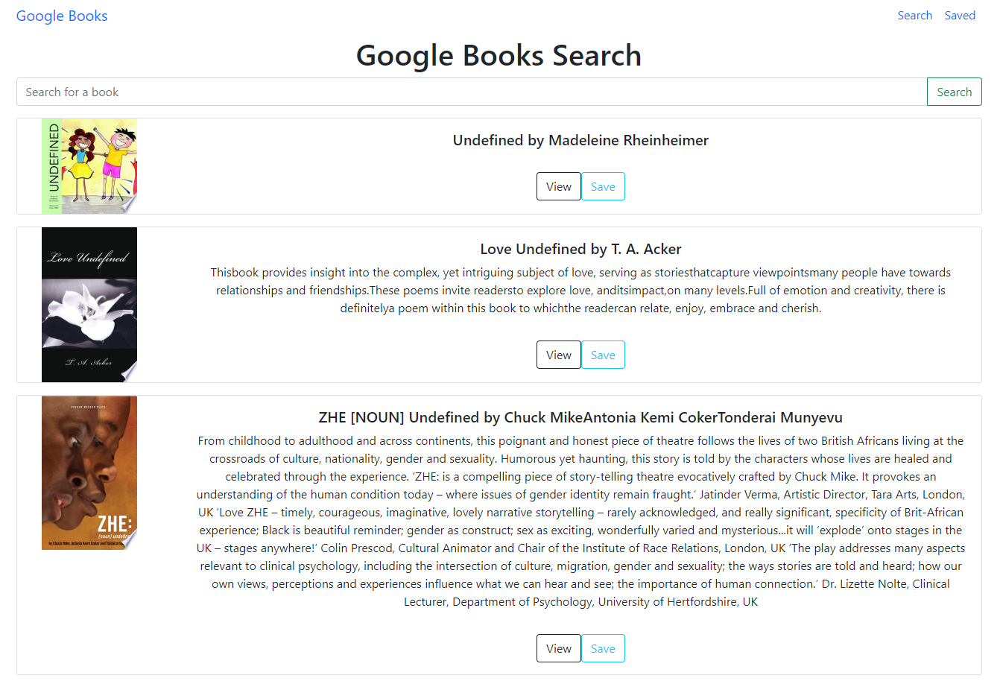
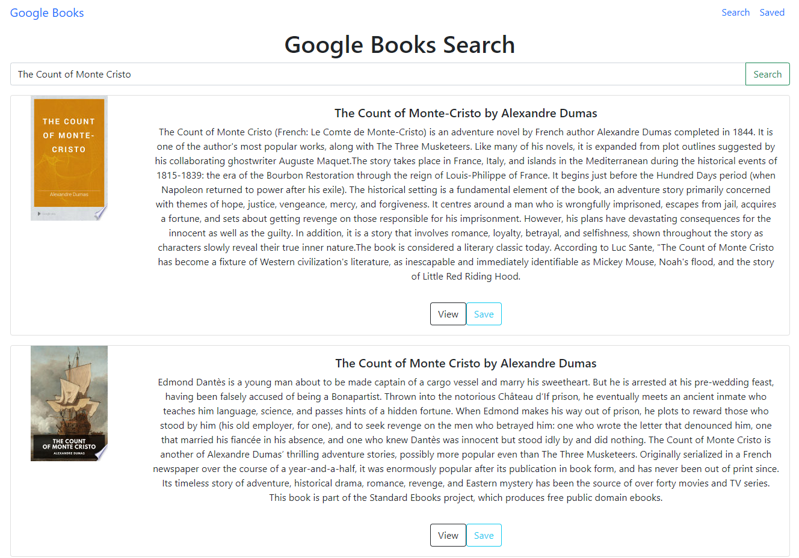

# Google Books Search

This MERN (MongoDB, Express, React, Node.js) app uses the full stack and the Google Books API to allow users to search, view, and save books. 

[See the deployed app on Heroku.](https://mysterious-dusk-67125.herokuapp.com/)

## Skills

- MongoDB
- Express
- React
- Node.js
- Bootstrap
- Heroku

## App Preview

